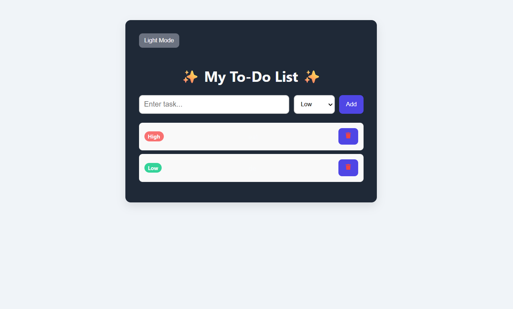

markdown
# ✨ MERN To-Do App ✨

# colorful, interactive, and modern To-Do List application** built with the **MERN stack (MongoDB, Express, React, Node.js)
Features **priority badges, animations, cute icons, dark/light mode, and task completion toggle #

---

## **Demo Screenshot**

  


## **Features**

- Add, update, and delete tasks  
- Assign priority: High / Medium / Low with colored badges  
- Click task to mark as completed  
- Trash icon for deleting tasks  
- Smooth animation for newly added tasks  
- Dark / Light mode toggle  
- Fully responsive and interactive  

---

## **Tech Stack**

- **Frontend:** React, Axios, React Icons, CSS3  
- **Backend:** Node.js, Express.js, CORS  
- **Database:** MongoDB (Local or Atlas)  

---

## **Getting Started**

### **1. Clone the repository**

```bash
git clone <your-repo-url>
cd simple-mern
````

### **2. Backend Setup**

```bash
cd backend
npm install
# Make sure MongoDB is running or use MongoDB Atlas connection string
npx nodemon index.js
```

* Backend runs on `http://localhost:5000`

---

### **3. Frontend Setup**


cd ../frontend
npm install
npm start


* React frontend runs on `http://localhost:3000` (or another port if 3000 is busy)

---

### **4. Usage**

1. Enter a task in the input box
2. Select priority (High / Medium / Low)
3. Click **Add** → task will appear with animation
4. Click on task text to **mark complete**
5. Click trash icon to **delete task**
6. Toggle **Dark / Light mode** using the button

---

## **Folder Structure**

simple-mern/
│
├─ backend/
│   ├─ index.js
│   ├─ models/
│   │   └─ Task.js
│   └─ routes/
│       └─ taskRoutes.js
│
├─ frontend/
│   ├─ src/
│   │   ├─ App.js
│   │   ├─ App.css
│   │   └─ components/
│   │       ├─ TaskInput.js
│   │       └─ TaskList.js
│   └─ package.json
│
└─ README.md

---

## **Dependencies**

### Backend

* express
* mongoose
* cors
* nodemon (dev)

### Frontend

* react
* react-dom
* react-scripts
* axios
* react-icons

---

## **License**

This project is licensed under the MIT License.

---

💡 **Tip:** Add a screenshot and optionally a GIF of task adding + animations for better GitHub presentation!

```


#
